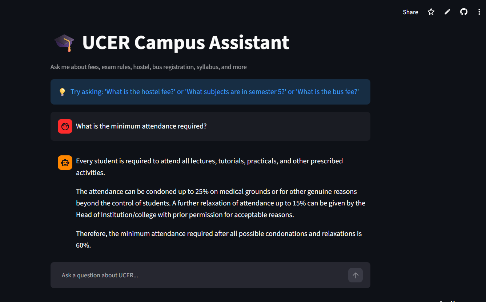

# 🎓 Autonomous Campus Assistant

An AI-powered RAG (Retrieval-Augmented Generation) chatbot developed to help UCER students instantly access information from official college documents.

The assistant provides accurate, document-grounded responses for common student queries such as:

- 📚 Syllabus
- 🏫 Hostel Information
- 💰 Fee Structure
- 🚌 Bus Registration
- 📅 Academic Calendar
- ✅ Attendance Rules
- 📝 Examination Guidelines

---

## ✨ Features

- AI-powered question answering using Retrieval-Augmented Generation (RAG)
- Answers generated only from official UCER/AKTU documents
- OCR support for scanned PDF documents
- Semantic search for accurate information retrieval
- Clean and responsive Streamlit interface
- Easy to extend by adding more documents

---

## 🛠️ Tech Stack

- Python
- Streamlit
- LangChain
- ChromaDB
- Google Gemini API
- Sentence Transformers
- PyPDF
- Tesseract OCR
- Git & GitHub

---

## 📸 Application Preview



---

## 🚀 Live Demo

https://campus-assistant-pyx8c5ft3pb3xp3vwhivyz.streamlit.app

> **Note:** The application is deployed on Streamlit Community Cloud. If inactive, it may take a few seconds to wake up.

---

## 📂 Project Structure

```
app.py                 # Streamlit application
chatbot.py             # RAG chatbot logic
build_database.py      # Builds vector database
ocr_pdf.py             # OCR for scanned PDFs
requirements.txt
data/
chroma_db/
images/
```

---

## 👩‍💻 Author

**Areesha Waseem**

B.Tech Computer Science & Engineering

United College of Engineering & Research, Prayagraj

---

## 📄 License

This project was developed as part of Summer Training 2026 for educational purposes.